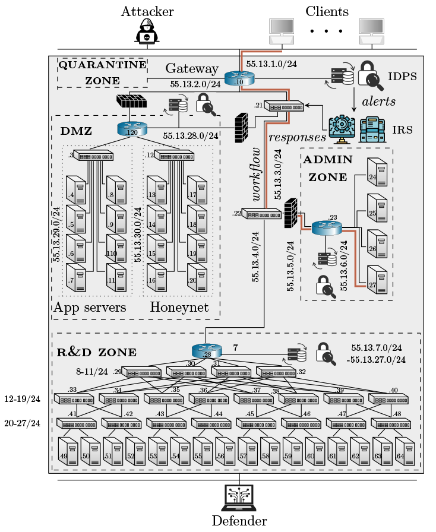

# Capture the Flag - Level 13

The target infrastructure in https://link.springer.com/chapter/10.1007/978-3-031-50670-3_9.

- Number of nodes: 64
- Number of OVS switches: 24
- Number of SDN controllers: 1
- IDS: Yes (Snort)
- Traffic generation: Yes
- Number of flags: 3
- Vulnerabilities: SSH, FTP, Telnet servers that can be compromised using dictionary attacks

## Architecture
<p align="center">

</p>


## Useful commands

```bash
make install # Install the emulation in the metastore
make uninstall # Uninstall the emulation from the metastore   
```

## Author & Maintainer

Kim Hammar <kimham@kth.se>

## Copyright and license

[LICENSE](../../../../../LICENSE.md)

Creative Commons

(C) 2020-2026, Kim Hammar