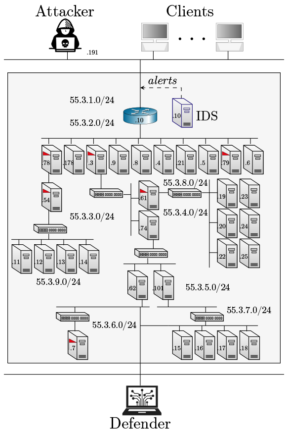

# Capture the Flag - Level 3

An emulation environment with a set of nodes that run common networked services such as SSH, FTP, Telnet, IRC, Kafka, 
etc. Some of the services are vulnerable to simple dictionary attacks as they use weak passwords. 
The task of an attacker agent is to identify the vulnerabilities and exploit them and discover hidden flags
on the nodes. Conversely, the task of the defender is to harden the defense of the nodes and to detect the 
attacker. 

- Number of nodes: 34
- IDS: No
- Traffic generation: No
- Number of flags: 6
- Vulnerabilities: SSH, FTP, Telnet servers that can be compromised using dictionary attacks

## Architecture
<p align="center">

</p>


## Useful commands

```bash
make install # Install the emulation in the metastore
make uninstall # Uninstall the emulation from the metastore   
```

## Author & Maintainer

Kim Hammar <kimham@kth.se>

## Copyright and license

[LICENSE](../../../../../LICENSE.md)

Creative Commons

(C) 2020-2026, Kim Hammar