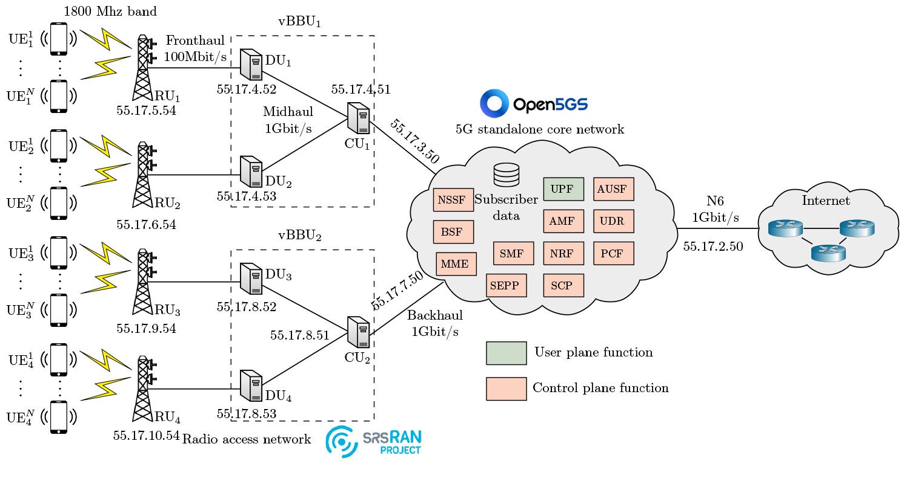

# Cloud RAN emulation, level 17

An emulation of a distributed 5G deployment that comprises two virtualized baseband units (vBBUs), 
where each vBBU implements a split baseband stack with multiple distributed units (DUs) connected to centralized units (CUs). 
In our setup, four DUs process radio functions and forward network traffic from radio units (RUs) over fronthaul links to two CUs, 
which aggregate and connect to the 5G core network via backhaul links. 
This architecture allows network traffic to flow between the RUs and the internet through the N6 interface of 
the core network.

During operation of the network, user equipment (UE) communicates with the RUs over the 1800 MHz band, 
with baseband processing split across the DU–CU interface. The DUs perform latency-sensitive lower physical-layer functions, 
while the CUs handle higher-layer processing and interface with the core network, 
which manages session establishment, mobility, slice allocation, and policy enforcement.

## Architecture
<p align="center">

</p>

## Useful commands

```bash
make install # Install the emulation in the metastore
make uninstall # Uninstall the emulation from the metastore 
```

## Author & Maintainer

Kim Hammar <kimham@kth.se>

## Copyright and license

[LICENSE](../../../../../LICENSE.md)

Creative Commons

(C) 2020-2025, Kim Hammar